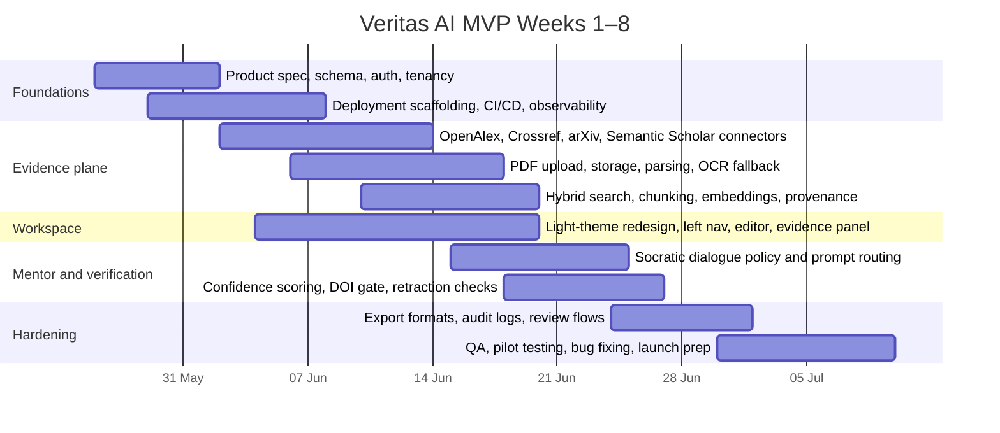

# Building a Production-Ready MVP for Veritas AI

## Executive summary

Veritas AI should be built as an **evidence-first writing and reasoning workspace**, not as a general “write my thesis” assistant. The strongest MVP is a narrow vertical slice: a verified student signs in, creates a thesis project, imports papers by topic/DOI/PDF, sees an evidence ledger with provenance and verification status, drafts one section such as the introduction or literature review, and receives **Socratic prompts** that interrogate claims against the indexed evidence rather than generating polished ghostwritten prose. This product position is both pedagogically stronger and more defensible from an academic-integrity perspective. Tutoring and dialogue-based systems have long shown measurable learning benefits; Bloom framed the “2 sigma” advantage of tutoring, later tutoring-system reviews found substantial gains over conventional instruction, and AutoTutor-style dialogue systems reported learning gains comparable with human tutors in some settings. At the same time, UNESCO and QAA both emphasise human-centred, integrity-preserving use of generative AI in education rather than unbounded substitution of student authorship. citeturn13search2turn20view1turn20view0turn20view3turn20view4

For the evidence layer, the best production baseline is to use **OpenAlex as the primary open metadata and open-access full-text source**, **Crossref as the DOI authority and retraction/correction authority**, **Semantic Scholar as enrichment and recommendation**, **arXiv for fresh preprints**, and **user PDF upload** as a first-class connector. OpenAlex now documents cached full-text PDFs for roughly 60 million works and TEI XML for roughly 43 million works produced with GROBID, while Crossref’s REST API exposes Retraction Watch retractions and DOI-linked updates. Semantic Scholar offers paper, author, citation, venue and embedding data, but its authenticated introductory rate limit is comparatively low, which makes it better as an enrichment layer than as the primary bulk transport. arXiv’s API is useful for recent preprints, but it explicitly asks developers to cache results, wait three seconds between repeated requests, and use OAI-PMH rather than the query API for larger harvesting tasks. citeturn26view0turn27view0turn26view2turn32view0

For core architecture, the simplest production-ready stack that still scales is: **Next.js on Vercel for the UI**, **FastAPI for the application API**, **PostgreSQL + pgvector + built-in full-text search for structured data, lexical search and semantic retrieval**, **object storage for PDFs and exports**, and a **real task queue or durable workflow engine** for Shadow Thesis jobs. PostgreSQL full-text search is built-in, pgvector keeps embeddings in the same ACID datastore and supports approximate nearest-neighbour search, and pgvector uses WAL so replication and point-in-time recovery still work. FastAPI’s built-in background tasks are suitable for lightweight after-response work, but Shadow Thesis research compilation is better served by a real queue such as Celery or a durable workflow runtime such as Temporal because those systems are designed for long-running, retryable workloads. citeturn31view0turn31view1turn23view2turn23view4turn23view5turn24search8turn24search1

The most important non-negotiable design choice is **auditability**. Recent studies and documentation show that citation fabrication and source-attribution failures remain a real risk with LLM-assisted writing, and OpenAI has itself published on why hallucinations persist. Therefore, every generated claim in Veritas AI should resolve to a provenance graph storing source IDs, DOI status, metadata match status, page-span evidence, retraction state, model/run identifiers, and human verification events. A “verified” badge should mean something operational: for example, the claim is backed by at least two DOI-verified sources or by one DOI-verified source plus a user-uploaded primary document with a matching quoted span, and neither source is marked retracted or corrected without disclosure. citeturn15search1turn15search4turn15search10turn27view0

An eight-week MVP is realistic for a **small team only if scope is disciplined**. For a 1–3 person team, the goal should be one polished section workflow, one institutional sign-in path, four public literature connectors, PDF ingestion, one evidence panel, and one export path. For a 4–8 person team, parallel work can deliver stronger verification, better observability and a more refined workspace redesign. For teams larger than that, the key risk is not engineering capacity but overbuilding too early. A disciplined MVP can likely run with modest baseline infrastructure costs, but model spend will dominate quickly if every mentor turn invokes a large reasoning model. Vercel Pro starts at $20/month, Vultr Cloud Compute starts at $5/month, Vultr managed databases start at $15/month, and Vultr standard object storage starts at $18/month, so the fixed infrastructure floor is manageable; token costs then scale with usage and model choice. citeturn11view0turn12search2turn10search3turn10search2turn33view3turn33view1

## Product goals and MVP vertical slice

The MVP should optimise for three product outcomes. First, **students must trust the evidence path**: every citation shown by the system should have a visible provenance chain and clear verification status. Second, **students must remain the author**: the mentor should improve reasoning quality, literature synthesis and claim discipline without becoming a one-click ghostwriter. Third, **advisers and institutions must be able to audit use**: the system must preserve a defensible record of what was suggested, what sources were shown, and what the user actually accepted or exported. Those goals align well with your current repo structure, which already separates a Next.js workspace from a FastAPI back end and includes the concepts of theses, papers, Socratic dialogue and Shadow Thesis in the data model. The redesign direction you specified in `DESIGN.md`—light theme, left navigation, central editor, right evidence panel—is also a better fit for an evidence-first academic workflow than the current dark, modal, single-flow experience. citeturn20view3turn20view4

### Product goals and success metrics

| Goal | KPI | MVP target | Why it matters |
|---|---|---:|---|
| Evidence trust | Citation validity rate on exported sections | **≥ 98%** real, resolvable citations | Prevents fabricated or broken references |
| Evidence usability | Median time from thesis creation to first usable evidence set | **< 10 minutes** | Measures ingestion/connectors quality |
| Mentoring value | % of sessions where user edits their own draft after mentor prompt | **≥ 60%** | Confirms active reasoning, not passive generation |
| Writing quality | Human rubric improvement on argument clarity after one session | **+1 rubric band** on pilot rubric | Measures actual thesis-helpfulness |
| Integrity | % of mentor responses that stay within policy | **≥ 99.5%** in red-team tests | Avoids ghostwriting and fabricated evidence |
| Reliability | Successful Shadow Thesis job completion | **≥ 95%** | Measures workflow robustness |
| Performance | Search-to-first-result in evidence panel | **< 2 seconds** p95 | Keeps workspace usable |
| Institutional readiness | Completeness of audit event logging for key actions | **100%** for sign-in, ingest, verify, export | Makes compliance and support feasible |

These metrics are recommended because the core retrieval and tutoring literature points to the importance of relevance, provenance and sustained dialogue, while current AI-integrity guidance stresses transparency, human judgement and assessment authenticity. citeturn14search3turn20view0turn20view3turn20view4

### MVP vertical slice roadmap

The table below is opinionated: it prioritises the **one-section workflow** rather than “full thesis generation”. Effort estimates are approximate and assume an experienced engineer working in the existing stack. Story points use a rough Fibonacci-style scale; hours are engineer-hours, not elapsed calendar time.

| Priority | Epic | Detailed tasks | Acceptance criteria | Effort | Dependencies |
|---|---|---|---|---|---|
| P0 | Auth and tenancy | Implement institutional email sign-in, magic-link verification fallback, session management, project-level authz, audit event for sign-in/sign-out | User can sign in with institutional email or configured SSO; every auth event recorded; protected routes enforced server-side | 5 SP / 16–24h | Frontend shell, Postgres |
| P0 | Thesis project creation | Create thesis, choose section template, capture topic/context, create initial Shadow Thesis job | New thesis creates DB rows, job queued, status visible in UI, recoverable on refresh | 3 SP / 8–12h | Auth, queue |
| P0 | Metadata connectors | Add OpenAlex, Crossref, Semantic Scholar, arXiv clients with retries, rate limiting, request logging, normalised source schema | Search by keyword/title/DOI returns normalised results with source badges and stable IDs | 8 SP / 24–40h | Queue, DB schema |
| P0 | PDF upload and parsing | Upload PDF, store file, run lightweight parse, run GROBID if machine-readable, OCR fallback for scans, extract references | User PDF appears in evidence list; text chunks created; references extracted where possible; OCR path only triggers when needed | 8 SP / 24–40h | Object storage, parser worker |
| P0 | Search and indexing | Chunk text, create embeddings, store lexical index and vector index, evidence retrieval API | Search returns relevant papers/chunks; hybrid retrieval returns stable rankings on test queries | 5 SP / 16–24h | Postgres/pgvector |
| P0 | Evidence ledger | Build right-panel evidence cards: DOI, title, source type, retraction status, quoted spans, confidence badge, provenance drill-down | Clicking a claim reveals linked evidence spans and metadata provenance | 8 SP / 24–36h | Connectors, indexing |
| P0 | Socratic mentor core | Implement dialogue state, section goal, prompt templates, refusal rules, source-aware questioning, citation-aware feedback | Mentor asks clarifying and evidential questions; does not output ready-to-submit section text when user has not supplied a draft | 8 SP / 24–36h | Evidence ledger, LLM routing |
| P0 | Workspace redesign | Implement light theme workspace with left nav, central editor, right evidence panel, stateful section tabs, timeline of job progress | Responsive UI matches redesign intent and supports draft + evidence + mentor simultaneously | 8 SP / 24–40h | Product design, frontend shell |
| P1 | Verification engine | Confidence scoring, DOI gate, metadata cross-check, human verify buttons, retraction/correction surfacing | Claim cards show green/amber/red; “verified” appears only when thresholds are met | 5 SP / 16–24h | Connectors, provenance schema |
| P1 | Export and citation formatting | Export selected evidence as BibTeX/RIS/CSL JSON, export session audit as JSON/CSV, copy formatted citation | Export works for verified sources; citation formats are standards-based | 3 SP / 8–16h | Evidence ledger |
| P1 | Observability and incidents | Structured logs, request IDs, job tracing, dashboards, alerting, dead-letter queue | Failed ingests visible within minutes; jobs and model calls traceable | 5 SP / 16–24h | Deployment pipeline |
| P1 | QA and pilot eval | Connector contract tests, prompt regression suite, rubric-based pilot, event analytics | Test suite passes in CI; pilot produces baseline metrics | 5 SP / 16–24h | Most of the above |

A disciplined small team should build only the P0 rows in Weeks 1–6 and spend Weeks 7–8 on verification, export, QA and operational hardening. A medium team can parallelise connectors, workspace and mentor work. A large team can additionally build institutional controls, adviser dashboards and stronger analytics, but those are not necessary for launch.

### UI and UX implementation guidance

The redesign should follow the supplied `DESIGN.md` direction very closely:

- **Left navigation** for projects, thesis sections, import actions and settings. This should feel like a research operating system, not a chat app.
- **Central editor** for student-authored text only. The primary action should be “improve this draft” or “audit this claim”, not “write section”.
- **Right evidence panel** for sources, evidence cards, conflicts, and verification states. This becomes the trust centre of the product.
- **Persistent top bar** for thesis title, section target, project status, and export actions.
- **Low-friction state changes**: idle, ingesting, evidence ready, drafting, review needed, verified, exportable.
- **Strong provenance affordances**: every highlighted claim in the editor should be able to open the exact supporting evidence on the right.

That layout mirrors the strengths of the design references you shared: cleaner spatial orientation, less modal friction, and clearer separation between writing, evidence and operations. It also aligns with tutoring research in which the dialogue system supports explanation and reflection rather than replacing the learner’s act of composition. citeturn20view0turn20view1

### Implementation prompts for frontend engineers and designers

Because a full standalone HTML/CSS prototype would be disconnected from your actual app router and component tree, the better option is to use targeted implementation prompts inside your existing Next.js/TypeScript codebase.

**Prompt one — workspace shell**

> Build a production-grade Next.js App Router workspace for Veritas AI using TypeScript and vanilla CSS modules or Tailwind only if already present. Follow this layout exactly: light academic SaaS theme; left navigation column for projects/sections/imports/settings; central drafting editor with autosave states; right evidence panel for source cards, confidence badges, DOI status, page spans, and “open provenance” actions. The page must feel like a premium research operating system, not a chatbot. Prioritise clarity, whitespace, typography hierarchy, subtle glass or paper surfaces, and visible system status. Add placeholder components for thesis sections, mentor thread, evidence cards, and export actions. Ensure responsive behaviour down to tablet widths.

**Prompt two — evidence panel system**

> Design and implement a reusable evidence panel component system for Veritas AI. Components required: SourceCard, ClaimEvidenceLink, ConfidenceBadge, RetractionWarning, DOIStatusPill, MetadataMatchRow, QuotedSpanPreview, and ProvenanceDrawer. Each source card must support journal article, preprint, uploaded PDF, and book chapter variants. The visual language should encode trust: green verified, amber provisional, red blocked, neutral imported. Clicking a claim must open the exact supporting spans and show metadata provenance from OpenAlex/Crossref/Semantic Scholar/arXiv. Use accessible colour contrast and clear empty/loading/error states.

**Prompt three — Socratic editor interaction**

> Implement a drafting workspace where the user remains the author. Create a central rich-text or markdown editor with inline claim highlighting, comment anchors, and section goals. The mentor interaction should appear as a structured Socratic sidebar thread, not a dominant chat window. The mentor must surface prompts such as “What evidence supports this claim?”, “Which paper gives the strongest methodological justification?”, and “Is this source primary, secondary, or speculative?”. Add UI controls for Resolve, Revise with evidence, Mark unsupported, and Save for adviser review. Avoid any design that suggests one-click thesis generation.

**Prompt four — first-run ingestion flow**

> Create the thesis initialisation and ingestion flow for Veritas AI. The flow should include: thesis title, topic/context, section target, source import options (search by topic, DOI, title, upload PDF), job progress timeline, and initial evidence shelf. The loading experience should visualise a Shadow Thesis engine compiling evidence with explicit stages: metadata search, DOI verification, PDF extraction, OCR fallback, citation indexing, and section briefing. Keep the presentation minimal, elegant and academically credible. Do not use gimmicky AI visuals; the tone should communicate rigour and trust.

**Prompt five — design system and state language**

> Produce a coherent design system for Veritas AI based on a light, research-grade interface. Define tokens for colour, spacing, border radius, shadows, typography, interactive states, and trust-state badges. Include patterns for loading, empty, blocked, verified, and review-required states. Use the following IA language consistently: Workspace, Evidence, Provenance, Verification, Shadow Thesis, Mentor, Draft, Export. Provide examples for desktop and tablet layouts. The result should feel closer to a premium document and knowledge tool than a marketing SaaS dashboard.

## Architecture and evidence infrastructure

The recommended architecture is intentionally conservative. Rather than introducing many new services, Veritas AI should first harden the current repository into a clean three-plane system: **workspace plane**, **evidence plane**, and **orchestration plane**. The workspace plane is the existing Next.js frontend. The evidence plane is a FastAPI API plus PostgreSQL storage, object storage, indexing, citation parsing and provenance tables. The orchestration plane is the Shadow Thesis workflow executor that performs research, retrieval, chunking, verification, scoring and section-brief generation. This separation keeps the UI responsive while long-running ingestion and verification tasks execute asynchronously. FastAPI’s own background tasks are useful for small after-response actions, but long-running multi-step jobs belong in a proper task queue or durable workflow system. citeturn23view4turn23view5turn24search8turn24search1

### Recommended component architecture

| Layer | Recommended baseline | Why this is the best MVP choice | Scale-up option |
|---|---|---|---|
| Frontend | Next.js App Router on Vercel | Native fit for current repo, preview deployments, analytics, middleware, SSR/streaming support | Keep on Vercel unless enterprise residency dictates otherwise |
| API | FastAPI + Pydantic + SQLAlchemy | Already in repo; strong typing; straightforward async endpoints | Split into API + worker packages if team grows |
| Primary DB | PostgreSQL | Strong relational model for users, theses, claims, citations, audits, exports | Managed PostgreSQL with read replica |
| Hybrid retrieval | PostgreSQL full-text search + pgvector | Simplest way to combine lexical and semantic retrieval in one ACID system | Add OpenSearch or dedicated vector store if corpus/traffic grows |
| Object storage | Vultr Object Storage or S3-compatible equivalent | Best place for PDFs, OCR outputs, exports, logs | Multi-bucket retention policies |
| Job orchestration | Celery for simplicity | Mature Python queue for retries and workers | Temporal if durable, resumable, multi-stage workflows become complex |
| Parsing | GROBID for scholarly PDF structure; OCRmyPDF only for scans | Scholarly PDF parsing with citation extraction; OCR fallback only where needed | Add specialist table/document parsing later |
| Auth | Auth.js or equivalent + institutional email gate, WorkOS for SSO/SCIM if selling to institutions | Fast developer velocity now, enterprise path later | Full org-scoped SSO/SCIM rollout |
| Audit | Application audit tables, optionally mirrored to WorkOS/enterprise log streams | Required for trust and institutional sales | SIEM export, org-level audit portal |

The architecture choices above are backed by the underlying capabilities of the official tools. Vercel’s Next.js platform adds preview deployments, SSR, streaming and integrated analytics; PostgreSQL provides built-in full-text search; pgvector adds vector search while preserving Postgres features such as joins and PITR; and Celery or Temporal are designed for real work queues and durable workflows. citeturn11view5turn31view0turn31view1turn23view2turn23view5turn24search8

### Ingestion and connector strategy

Use **OpenAlex as the main discovery index**. It exposes Works, Authors, Sources, Institutions, Topics and more; it also now offers cached full-text PDFs and GROBID-produced TEI XML for millions of open-access works, with filters such as `has_content.pdf:true`, `has_fulltext`, `is_retracted`, `doi`, `has_pdf_url`, and `has_references`. OpenAlex explicitly warns that TEI output can contain parsing errors and that GROBID does not do OCR, which is exactly why Veritas AI should treat OpenAlex XML as a helpful pre-parse rather than indisputable truth. It also stresses that the original copyright remains with the underlying PDFs, so the product must respect licence metadata and avoid over-assuming reuse rights. citeturn26view1turn26view0

Use **Crossref as the verification backbone**. Crossref’s REST API remains the best DOI-centric metadata authority in this stack, and Crossref now surfaces Retraction Watch retractions in the API via `update-type:retraction` and `update-to` metadata. Crossref’s content negotiation is also practical for exporting verified references in common formats such as BibTeX and RIS. In Veritas AI, Crossref should therefore be treated as the source of truth for DOI validity, update/retraction status, and export-grade citation metadata. citeturn27view0turn29search0

Use **Semantic Scholar as enrichment** and similarity/recommendation support, not as the sole source of truth. Semantic Scholar’s API exposes papers, citations, venues, authors, recommendations and SPECTER2 embeddings, but the introductory authenticated rate limit is low. That makes it excellent for recommendation, related-paper discovery, citation-graph enrichment and surface-level cross-checking, but weaker as the primary ingestion engine for large production jobs. citeturn26view2

Use **arXiv for freshness and preprints**. The arXiv API exposes Atom feeds with title, summary, authors, categories, dates and links, but it is intentionally conservative: developers are asked to delay repeated requests by three seconds, cache same-query results across a day, and prefer OAI-PMH for bulk harvesting. In practice, Veritas AI should use arXiv to pick up preprints that may not yet be richly represented elsewhere, mark them visibly as preprints, and apply stricter gating when they are used as support for high-confidence thesis claims. citeturn32view0

Use **user PDF upload as a first-class path**, because thesis workflows often involve library downloads, unpublished reports, institutional repositories, scanned chapters and adviser-supplied documents. Uploaded PDFs should be stored immutably, virus-scanned, parsed if machine-readable, and sent through OCR only when necessary. OCRmyPDF documents both online deployment considerations and PDF security issues, including the reality that PDFs may contain malware; that is a strong argument for running OCR in an isolated worker container with strict file/time/CPU limits rather than in the request path. citeturn30view2turn30view0

### LLM choices and prompt routing

The router should optimise for **cost, latency and evidential risk**, not for one “best” model.

| Task type | Recommended default | Why | Notes |
|---|---|---|---|
| Classification, source normalisation, metadata dedupe | **gpt-5.4-mini** or **Gemini 2.5 Flash-Lite** | Lower-cost models are sufficient for structured tasks and routing | Keep prompts schema-bound and deterministic |
| Evidence summarisation and section brief generation | **gpt-5.4** or **Gemini 2.5 Flash** | Better long-context reasoning without using the most expensive tier for every call | Use retrieval-anchored prompts only |
| Difficult synthesis, contradiction analysis, mentor escalation | **gpt-5.5** or **Gemini 2.5 Pro** | Reserved for ambiguous, high-value reasoning tasks | Require citation and claim-evidence output schema |
| Realtime voice or live advising later | Provider-specific realtime models | Not needed for MVP vertical slice | Defer |

OpenAI’s current official docs position **gpt-5.5** as the flagship for complex reasoning and coding and **gpt-5.4-mini / nano** as lower-cost, lower-latency options, all available through the Responses API with tool support and request IDs suitable for production tracing. Google’s official Gemini docs position **Gemini 2.5 Pro** for complex tasks, **Gemini 2.5 Flash** for reasoning at better price-performance, and **Gemini 2.5 Flash-Lite** as the smallest and most cost-effective model. citeturn7view1turn7view2turn7view0turn33view3turn33view1

The router should also be **risk-aware**:

- If the task asks for citation creation or source-backed critique, force retrieval and structured output.
- If the user has not provided any draft text, the mentor should default to questions, outlines, concept maps and evidence prompts.
- If the claim touches methodology or literature consensus, route to a stronger reasoning model and require at least two independent evidence objects.
- If the job is bulk ingestion or chunk summarisation, use the cheapest reliable model and batch where possible.

This is not just a cost optimisation. It is a trust optimisation grounded in both the RAG literature and the documented persistence of hallucinations in LLM systems. citeturn14search3turn15search10

### Shadow Thesis orchestration

A robust Shadow Thesis workflow should look like this:

1. **Project intake**  
   Store thesis topic, section target, user context, institution flag, and configuration.
2. **Evidence discovery**  
   Query OpenAlex/Crossref/Semantic Scholar/arXiv using a generated search plan.
3. **Acquisition**  
   Pull metadata, OA full text where lawfully available, and upload-derived files.
4. **Normalisation**  
   Canonicalise source IDs, DOI, title, authorship, venue, year, source type.
5. **Parsing**  
   Extract text, references, headings, tables/figures where useful.
6. **Indexing**  
   Chunk, embed, create lexical vectors, attach provenance.
7. **Verification**  
   Run DOI checks, metadata cross-matches, retraction/correction checks, duplicate merges.
8. **Claim graph synthesis**  
   Build candidate claims, supporting/contradicting evidence, and section brief.
9. **Mentor packaging**  
   Expose section targets, evidence cards and Socratic prompts to the UI.
10. **Audit closeout**  
   Write model IDs, request IDs, tool calls, job outcomes and reviewer actions.

For a small team, use Celery plus explicit job tables. For medium-to-large teams, Temporal becomes attractive because durable workflows, resumability and event histories map naturally onto Shadow Thesis compilation. Temporal’s own docs position it as an open-source durable execution platform whose workflows resume from where they left off after failures. citeturn23view5turn24search8turn24search1

### Provenance and auditability schema

The minimum viable provenance schema should be explicit rather than hidden inside blobs.

| Table | Purpose | Key fields |
|---|---|---|
| `users` | Identity and organisation binding | `id`, `email`, `institution_domain`, `org_id`, `role`, `verified_at` |
| `theses` | Thesis project root | `id`, `user_id`, `title`, `topic_context`, `status`, `created_at` |
| `sections` | Drafting targets | `id`, `thesis_id`, `slug`, `goal`, `draft_text`, `draft_version` |
| `source_records` | Canonical scholarly record | `id`, `canonical_doi`, `source_provider`, `provider_id`, `title`, `authors_json`, `venue`, `year`, `type`, `is_retracted`, `licence`, `metadata_hash` |
| `document_assets` | File-level artefacts | `id`, `source_record_id`, `storage_uri`, `mime_type`, `parse_status`, `ocr_status`, `sha256`, `page_count` |
| `chunks` | Searchable text units | `id`, `document_asset_id`, `page_from`, `page_to`, `char_start`, `char_end`, `text`, `tsvector`, `embedding` |
| `claims` | Normalised factual assertions surfaced to user | `id`, `section_id`, `claim_text`, `claim_type`, `status`, `confidence_score` |
| `claim_evidence_links` | Many-to-many support/contradiction mapping | `claim_id`, `chunk_id`, `relation`, `support_score`, `quote_excerpt` |
| `verification_events` | Machine and human checks | `id`, `claim_id`, `check_type`, `result`, `details_json`, `reviewer_user_id`, `created_at` |
| `mentor_turns` | Dialogue record | `id`, `section_id`, `user_message`, `assistant_message`, `policy_mode`, `model_id`, `request_id` |
| `job_runs` | Background execution trace | `id`, `thesis_id`, `workflow_type`, `status`, `attempt`, `started_at`, `finished_at`, `error_json` |
| `audit_events` | Security/compliance record | `id`, `actor_user_id`, `action`, `target_type`, `target_id`, `context_json`, `occurred_at` |
| `exports` | What left the system | `id`, `thesis_id`, `format`, `selection_json`, `generated_by`, `created_at` |

This schema is deliberately verbose because institutions will care less about whether you used one model or another, and more about whether you can explain how a citation, suggestion or export came to exist. That need is reinforced by WorkOS’s own audit event model—action, actor, targets and context—and by OpenAI’s recommendation to log request IDs in production. citeturn21view3turn7view2

## Verification model and Socratic mentor

The evidence-verification layer must be mechanical before it is rhetorical. That principle is now essential because citation fabrication remains an active failure mode in AI-assisted research workflows. Observational work in medical writing found high rates of fabricated or inaccurate ChatGPT references, recent “ghost citation” analyses argue the problem is systemic, and OpenAI’s own 2025 paper explains why models still guess when uncertain. Veritas AI should therefore never treat a model-generated citation as trusted until the system has resolved it against external metadata, checked its status, and linked it to an accessible evidence object. citeturn15search1turn15search4turn15search10

### Recommended evidence confidence model

Treat confidence as an operational score from 0–100. The exact weights below are a product recommendation, not an industry standard.

| Signal | Example test | Score effect | Gating action |
|---|---|---:|---|
| DOI resolution | DOI resolves through Crossref/content negotiation | +25 | Required for “DOI verified” |
| Cross-source metadata match | Title/year/authors consistent across Crossref + OpenAlex, or Crossref + Semantic Scholar | +15 | Required for green badge unless user uploaded primary document |
| Full-text accessibility | PDF or parsed text available | +10 | Enables page-span evidence |
| Quoted span match | Claim linked to exact sentence/page span | +15 | Required for claim-level verification |
| Retraction/correction | Retracted, corrected, or ambiguous update chain | −100 to −40 | Block or disclose prominently |
| Source type | Peer-reviewed article +10; preprint +3; blog/web page 0 | Variable | Used in overall score |
| Parse quality | GROBID parse high / OCR low-confidence | +5 / −5 | Controls UI confidence tone |
| Human verification | Adviser or user explicitly confirms evidence fit | +20 | Enables “reviewed” badge |
| Contradiction detected | High-confidence contradicting evidence | −20 | Forces “review needed” |

Recommended thresholds:

- **Green verified**: 80+ and no blocking integrity issue.
- **Amber provisional**: 60–79 or missing one key signal.
- **Red blocked**: under 60, unresolved citation, retracted source, or inconsistent metadata.

Crossref and OpenAlex both expose retraction-aware metadata, OpenAlex flags `is_retracted`, and Crossref’s updated API includes Retraction Watch-sourced retractions; those capabilities should be central to the gating layer rather than optional polish. citeturn27view0turn26view1

### Citation extraction and metadata policy

Citation extraction should follow a **layered parse policy**:

- If OpenAlex already has TEI XML and the work is open-access, ingest that first.
- If the user uploads a machine-readable PDF, run GROBID locally.
- If the PDF is scanned or image-only, OCR first, then parse references where feasible.
- If parsing fails, keep the PDF searchable and mark references as “not machine-extracted”.
- Never silently invent missing fields; leave them null and surface uncertainty.

This policy is directly supported by the source tooling: OpenAlex notes that its TEI XML comes from GROBID, that GROBID can miss or duplicate references, and that GROBID does not perform OCR; OCRmyPDF exists precisely to add searchable text layers to scanned PDFs. citeturn26view0turn30view2

### Socratic mentor dialogue policy

The mentor should adopt a **pedagogical contract** rather than a general assistant persona. It should do five things well:

1. Clarify the user’s intended claim.
2. Ask what evidence supports or limits that claim.
3. Push the user to distinguish background, method, result, interpretation and implication.
4. Surface contradictions, missing citations and weakly supported generalisations.
5. Help the student revise *their* draft, not replace it wholesale.

That structure is consistent with dialogue-based tutoring systems such as AutoTutor and with the broader tutoring literature showing that interactive questioning supports learning gains. It is also consistent with UNESCO and QAA guidance that AI use in education should preserve human agency, judgement and integrity. citeturn20view0turn20view1turn20view3turn20view4

### Prompt templates and scaffolding flows

A practical mentor prompt library for the MVP should include templates such as:

- **Context and urgency**: “What gap in the literature does this section need to establish?”
- **Claim support**: “Which source best supports this sentence, and what limitations does it report?”
- **Method fit**: “Is this source empirical, theoretical, or review-based, and is that the right evidence type here?”
- **Consistency check**: “Two sources here disagree. What explains the disagreement—sample, method, time period, or interpretation?”
- **Precision check**: “Can this sentence be narrowed from a universal claim to what the cited evidence actually shows?”
- **Integrity check**: “Have you personally read the source you are invoking, and can you identify the relevant pages?”

Recommended UX states in the mentor thread:

- **Idle**: waiting for user draft or evidence selection.
- **Evidence ready**: enough verified material to begin.
- **Needs support**: highlighted claims not yet grounded.
- **Review needed**: contradiction, unclear citation, or low confidence.
- **Verified for section**: threshold met for current section export.

### Guardrails against ghostwriting

Do not market or implement Veritas AI as an autonomous dissertation author. Concrete guardrails should include:

- No generation of full polished thesis sections from a blank page in “student mode”.
- If the user supplies no draft, the mentor may provide **questions, outlines, source maps, concept summaries and checklists**, but not a ready-to-submit section.
- Rewriting should be limited to user-provided sentences or paragraphs.
- Every substantive suggestion should be source-linked when possible.
- A visible disclosure banner should remind users that responsibility for authorship and citation remains theirs.
- “Export as section draft” should be disabled unless the content originated substantially from user editing rather than direct model generation.

This is the safest way to align the product with academic-integrity guidance and with the actual value of the Socratic framing. citeturn20view3turn20view4

## Security privacy and integrity

The security model should assume that Veritas AI may handle **student identifiers, drafts, assessment-adjacent work, licensed PDFs and institution-linked accounts**. That means security and privacy cannot be an afterthought.

Next.js’ current authentication guidance encourages using a dedicated authentication library for security and simplicity, separating authentication, session management and authorisation. Auth.js supports email-based sign-in with verification tokens and requires a database-backed token store for that flow. If institutional sales matter in the MVP or immediately after it, WorkOS is a credible path because its SSO layer supports both SAML and OIDC, and its SCIM documentation covers user and group synchronisation for organisational provisioning. citeturn21view0turn21view1turn21view2turn21view4

### Recommended security and privacy controls

| Area | MVP recommendation | Why |
|---|---|---|
| Identity | Institutional email verification by default; magic-link fallback; optional WorkOS SSO for pilot institutions | Simple student verification now, enterprise path later |
| Session security | Server-side session checks; httpOnly cookies; route protection in middleware/server components | Prevents client-side bypass |
| API secrets | Keep all LLM and connector keys server-side only | OpenAI explicitly warns against exposing API keys client-side |
| Data minimisation | Store only the minimum personal data needed for auth, ownership and support | Aligns with UK GDPR/ICO principles |
| Retention | Separate retention policies for auth data, drafts, audit logs, uploaded files and exports | Matches storage-limitation principle |
| Encryption | TLS in transit, encrypted volumes/object storage at rest | Baseline for any student-facing system |
| Audit trail | Log sign-in, source imports, verification actions, exports, and admin changes | Needed for support, trust and possible compliance reviews |
| File safety | Virus scan and sandbox all uploads; OCR in isolated worker containers | PDFs are a real attack surface |
| Export controls | Let users export citations and their own drafts; do not export private third-party PDFs without entitlement | Copyright and privacy protection |
| Data deletion | Soft-delete with short recovery window, then hard-delete/anonymise on schedule | Supports user rights and operational safety |

OpenAI’s API reference explicitly says API keys are secrets and should not be exposed in client-side code, and also recommends logging request IDs for production troubleshooting. ICO guidance on data minimisation and storage limitation says organisations should hold only the data needed for their purposes and not keep it longer than necessary. FERPA guidance underscores that education-record privacy and disclosure tracking matter wherever student records are implicated. citeturn7view2turn22search0turn22search15turn22search16turn22search1

### Academic integrity controls

Do not rely on “AI-writing detection” as the centrepiece. The more defensible integrity posture is:

- provenance-based evidence checks,
- process logging,
- section-level audit trails,
- user-visible support/uncertainty states,
- optional similarity checking where institutions require it.

For similarity, Crossref’s Similarity Check is powerful but institutionally constrained: it is a Crossref member service powered by iThenticate, intended for participants who register DOI-assigned content and expose full-text URLs in metadata. For Veritas AI as an MVP, the realistic path is either an institution-supplied iThenticate/Turnitin integration or a delayed enterprise option, not a hard dependency at launch. Turnitin’s integrator docs do support API-based submission and report retrieval where an institution is already licensed. citeturn27view1turn27view2

### Export formats

Veritas AI should support at least these exports on day one:

- **BibTeX** and **RIS** for reference managers,
- **CSL JSON** as the internal citation interchange layer,
- **JSON/CSV audit export** for provenance and review events,
- **Markdown or DOCX draft export** for student writing,
- **PDF evidence packet** only for user-generated summaries and legally exportable excerpts.

Crossref’s content negotiation supports common bibliographic formats such as BibTeX and RIS, while the Citation Style Language remains the open standard for citation formatting, with a large style ecosystem. Citation.js is a practical open-source bridge for converting DOI/BibTeX/Wikidata inputs into CSL-JSON and back to formats such as BibTeX and RIS. citeturn29search0turn29search13turn29search2turn29search3

## Testing deployment and cost

The testing plan should be structured around four layers: **connector correctness**, **retrieval quality**, **mentor policy conformance**, and **end-user value**. Unit tests should cover parsing, metadata normalisation, confidence-scoring logic, and export formatting. Integration tests should run against fixture responses from OpenAlex, Crossref, arXiv and Semantic Scholar, plus sample PDFs covering born-digital articles, scans, malformed files and retracted works. Contract tests matter here because public scholarly APIs evolve independently. citeturn26view1turn27view0turn32view0turn26view2

A useful evaluation harness for the Shadow Thesis engine should measure:

- metadata precision/recall on known DOI/title pairs,
- retrieval precision at k for section-specific queries,
- citation validity rate,
- claim-to-evidence grounding precision,
- mentor refusal/guardrail compliance,
- end-to-end job success and median completion time.

For user testing, the first pilot should be **10–20 graduate students** completing a single section task and **3–5 faculty/adviser reviewers** rating evidence quality and integrity posture. Compare Veritas AI against a baseline workflow such as Zotero + manual searching + a general LLM. Success should be judged less by “word count produced” and more by faster evidence assembly, better citation discipline and improved draft quality. That emphasis is supported by both tutoring-system evidence and academic-integrity guidance. citeturn20view1turn20view3turn20view4

### Deployment plan

Containerise the backend and workers, but keep the frontend on Vercel. That gives you fast preview deployments and frontend collaboration while keeping ingestion, OCR and parsing on persistent compute. Next.js on Vercel is documented as zero-configuration, with preview URLs per pull request and built-in support for SSR, streaming, middleware and analytics. citeturn11view5turn11view0

Recommended deployment shape:

- **Frontend**: Vercel project connected to Git, preview deployments enabled.
- **Backend API**: Dockerised FastAPI on Vultr compute.
- **Workers**: Separate worker container on Vultr for ingestion/OCR/Shadow Thesis jobs.
- **Database**: Vultr managed PostgreSQL, unless you self-manage Postgres to save cost.
- **Object storage**: Vultr Object Storage or other S3-compatible bucket.
- **Container image storage**: Vultr Container Registry or GitHub Container Registry.
- **Backups**: nightly logical backup + PITR/WAL strategy.
- **Monitoring**: application-level structured logs, queue/job telemetry, DB health, ingest failure alerts.

PostgreSQL’s docs explicitly recommend setting up and testing WAL archiving before relying on PITR. citeturn23view2

### Cost estimates

The table below gives **directional monthly estimates** for baseline infrastructure. LLM spend is shown separately because it can exceed fixed hosting costs quickly. Costs vary by region, traffic and storage growth.

| Cost item | Small team 1–3 | Medium team 4–8 | Large team >8 | Basis |
|---|---:|---:|---:|---|
| Vercel seats | $20–$40 | $60–$120 | $160+ | Pro starts at $20/month; additional owner/member seats $20/month |
| Backend compute | $5–$28 | $28–$84 | $84–$168+ | Vultr Cloud Compute starts at $5/month; optimised compute starts higher |
| Worker compute | $5–$28 | $28–$56 | $56–$112+ | Separate OCR/ingest worker recommended |
| Managed PostgreSQL | $15–$45 | $45–$135 | $135+ | Vultr managed DB starts at $15/month |
| Object storage | $18–$36 | $18–$72 | $72+ | Vultr standard object storage starts at $18/month |
| Block/backup storage | $5–$15 | $10–$30 | $30+ | Vultr block storage is $1 per 10 GB |
| Container registry | $0–$5 | $5–$10 | $10–$20 | Optional depending on registry choice |
| Fixed infra subtotal | **~$68–$197** | **~$166–$507** | **~$463+** | Before model usage |
| Illustrative LLM spend | OpenAI: ~$79 / Gemini Flash-Lite: ~$9 | OpenAI: ~$200+ / Gemini Flash-Lite: ~$23+ | Highly usage-dependent | Example assumption: 5k–10k mentor turns/month |

Pricing basis from official provider material: Vercel Pro starts at $20/month and additional owner/member seats are $20/month; Vultr Cloud Compute starts at $5/month; Vultr managed databases start at $15/month; Vultr standard object storage is $18/month; and Vultr block storage is $1 per 10 GB. OpenAI’s current pricing lists gpt-5.4-mini at $0.75/MTok input and $4.50/MTok output, while Google lists Gemini 2.5 Flash-Lite standard pricing at $0.10/MTok input and $0.40/MTok output. citeturn11view0turn10search7turn12search2turn10search3turn10search2turn10search16turn33view3turn33view1

A practical CI/CD setup is GitHub Actions for lint/test/build plus deployment hooks to Vercel and Vultr. For database evolution, Alembic is the standard SQLAlchemy migration tool and should be added immediately if it is not already wired in. citeturn23view3

## Timeline risks and recommended stack

### Suggested eight-week plan

The timeline below assumes a disciplined MVP with one polished section workflow, not a complete thesis-writing platform.

For a small team, this schedule is only feasible if you avoid adviser dashboards, collaboration, billing, live voice, mobile apps and broad institutional admin tooling. For a medium team, connectors, workspace and mentor work can proceed in parallel. For a large team, the biggest mistake would be broadening scope rather than hardening the same vertical slice.

### Prioritised risks and mitigation

| Risk | Why it matters | Mitigation |
|---|---|---|
| Citation hallucinations | Directly undermines thesis trustworthiness | Mechanical DOI gating, metadata cross-checking, page-span evidence, human verify step |
| Ghostwriting perception | Could block institutional adoption | Product copy, UI flows and prompt policy must centre drafting support, not autonomous writing |
| API churn and rate limits | Public scholarly APIs can change or throttle | Cache aggressively, build connector adapters, queue retriable jobs, store raw responses |
| PDF parsing quality | Scholarly PDFs are messy; scans are worse | Layered parser policy, OCR fallback, store confidence per parse, preserve original file |
| Cost creep from large models | Token spend can outgrow hosting | Strong routing, cheaper models for extraction/classification, batch where safe |
| Weak provenance visibility | Users will not trust black-box claims | Right-panel provenance drawer, evidence badges, exportable audit record |
| SSO and institutional complexity | Enterprise deals slow down if not planned | Start with email verification; design org-scoped auth model early; add WorkOS path when needed |
| Privacy/compliance mistakes | Student data is sensitive | Data minimisation, retention schedules, audit logging, deletion workflows, server-only secrets |
| Overbuilding Shadow Thesis | Risk of spending weeks on agent complexity before delivering user value | Keep workflow deterministic and inspectable before adding sophisticated agents |

These are the most material launch risks because the public connector ecosystem, current LLM failure modes and educational-integrity environment all point to trust, scope and operational robustness as the real determinants of viability. citeturn26view2turn32view0turn15search10turn20view3turn20view4

### Recommended open-source libraries, APIs and papers to prioritise

| Category | Recommendation | Why prioritise it | Source |
|---|---|---|---|
| Scholarly metadata API | OpenAlex | Broad open catalogue, strong filters, OA full text, TEI XML, retraction flags | citeturn26view1turn26view0 |
| DOI/retraction API | Crossref REST API | DOI authority, update chains, Retraction Watch integration, export formats | citeturn27view0turn29search0 |
| Enrichment API | Semantic Scholar API | Citation/recommendation graph, paper enrichment, embeddings | citeturn26view2 |
| Preprint API | arXiv API | Recent preprints with queryable metadata | citeturn32view0 |
| PDF parsing | GROBID | State-of-the-art scholarly PDF → TEI parsing | citeturn26view0turn4view0 |
| OCR | OCRmyPDF | Searchable text layer for scanned PDFs; container-friendly deployment | citeturn30view2turn30view0 |
| Primary datastore | PostgreSQL | Strong relational base and built-in full-text search | citeturn31view0 |
| Vector search | pgvector | Keeps vectors in Postgres with ANN support and WAL/PITR compatibility | citeturn31view1 |
| Migrations | Alembic | Standard SQLAlchemy migrations | citeturn23view3 |
| Worker queue | Celery | Mature Python queue for long-running jobs | citeturn23view5 |
| Durable workflows | Temporal | Strong option when Shadow Thesis workflows become long and stateful | citeturn24search8turn24search1 |
| Frontend auth | Auth.js | Fast path for email/OAuth auth in Next.js | citeturn21view1turn16search10 |
| Enterprise auth | WorkOS | SAML/OIDC SSO, SCIM provisioning, audit log/stream support | citeturn21view2turn21view4turn21view5 |
| Citation formatting | CSL + Citation.js | Standards-based citation rendering and interchange | citeturn29search13turn29search2turn29search3 |
| Key paper | Bloom, *The 2 Sigma Problem* | Frames tutoring advantage and educational aspiration | citeturn13search2 |
| Key paper | Kulik & Fletcher, *Effectiveness of Intelligent Tutoring Systems* | Meta-analytic justification for tutoring-system value | citeturn20view1 |
| Key paper | Graesser, *Conversations with AutoTutor Help Students Learn* | Dialogue-based tutoring design precedent | citeturn20view0 |
| Key paper | Lewis et al., *Retrieval-Augmented Generation* | Foundational retrieval-grounded generation reference | citeturn14search3 |
| Key paper | Priem et al., *OpenAlex* | Explains the scholarly graph OpenAlex provides | citeturn28search3 |
| Key paper | Kinney et al., *The Semantic Scholar Open Data Platform* | Explains the Semantic Scholar pipeline and APIs | citeturn28search5 |

### Open questions and limitations

Some important decisions are still genuinely unspecified, so the recommendations above are intentionally framed as options:

- **Team size and budget** are unspecified, so effort and cost are given in ranges rather than a single forecast.
- **Target institution type** is unspecified. A direct-to-student MVP can begin with institutional email verification; institution-led pilots may require SSO and audit exports much earlier.
- **Licensing and entitlement policy** for uploaded/library PDFs is unspecified. That policy should be settled before broad trials.
- **Adviser workflow** is unspecified. The report assumes student-first MVP, with adviser review added only where necessary.
- **Repository state beyond the structure you provided** was not assumed. Recommendations therefore focus on architecture and delivery strategy rather than code-level refactors.

The highest-confidence conclusion is straightforward: **ship a trust-heavy, evidence-led, one-section Socratic workspace first**. If Veritas AI proves that it can reliably ingest literature, show provenance, question weak claims and improve student-authored drafts without ghostwriting, it will have a much stronger production foundation than a broader but less defensible “AI thesis writer.”